# 🛍️ OOP E-Commerce System

> A complete console-based E-Commerce system demonstrating core Object-Oriented Programming concepts including inheritance, polymorphism, encapsulation, operator overloading, and file I/O.

---

# OOP E-Commerce System

**Course:** Object Oriented Programming (OOP) | **Semester:** Spring 2025 | **Instructor:** Sir Muzahir Saleem | **University:** UMT, Lahore Campus

## Table of Contents

1. Team Members
2. OOP Concepts Demonstrated
3. Features
4. How to Compile and Run
5. Data Files Created
6. Project Structure
7. Sample Output
8. Related Projects
9. Submission Details

## Team Members

| Name | Roll Number |
|------|-------------|
| Muhammad Anas Tahir | F2024266985 |
| Zohaib Ahmad | F2024266251 |
| Muhammad Talha Bhatti | F2024266503 |

## OOP Concepts Demonstrated

| Concept | Implementation |
|---------|----------------|
| Encapsulation | Private members with public getters/setters in Product class |
| Inheritance | Admin and Customer inherit from EcommerceSystem class |
| Polymorphism | Virtual destructor in base class |
| Operator Overloading | << operator for Product display using friend function |
| Static Members | totalProducts counter across all Product instances |
| Exception Handling | Try-catch for file operations in constructor |
| File I/O | Persistent storage (products.txt, users.txt, sales.txt) |
| Friend Function | operator<< as friend of Product class |

## Features

**Admin Panel:** View sales records | Add new products | Remove products | View product catalog

**Customer Panel:** Register new account | Login with credentials | Browse products by category (Electronics, Books, Furniture, Beauty, Grocery) | Add to cart with stock validation | View cart with running total | Checkout and complete purchase

## How to Compile and Run

**Windows:**
g++ src/Project.cpp -o ecommerce.exe
./ecommerce.exe

**Linux / Mac:**
g++ src/Project.cpp -o ecommerce
./ecommerce

**Admin Access Password:** admin123

## Data Files Created

| File | Purpose |
|------|---------|
| products.txt | Product catalog (25 default products across 5 categories) |
| users.txt | Registered user credentials (username and password) |
| sales.txt | Transaction records from customer checkouts |

## Project Structure

OOP-Ecommerce-System/
├── src/
│   └── Project.cpp
├── docs/
│   └── OOP_Project_Documentation.docx
├── README.md
└── .gitignore

## Sample Output

Welcome to the E-commerce System!
Are you a:
1. Admin
2. Customer
Choose 1 or 2: 2

Customer Portal:
1. Register
2. Login
3. Exit
Choose an option: 1
Enter username: anas
Enter password: ****
User registered successfully!

--- Customer Menu ---
1. Select Category and Add Products
2. View Cart
3. Checkout
4. Logout

## 📸 Screenshots

### Main Menu
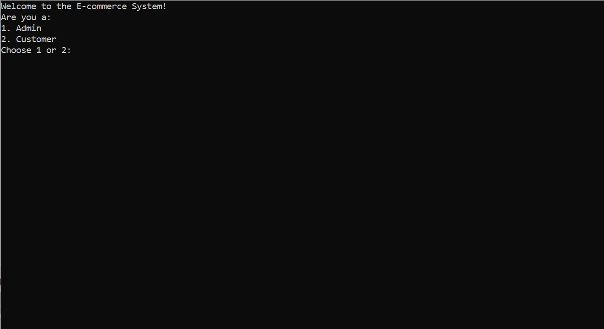

### Admin Panel
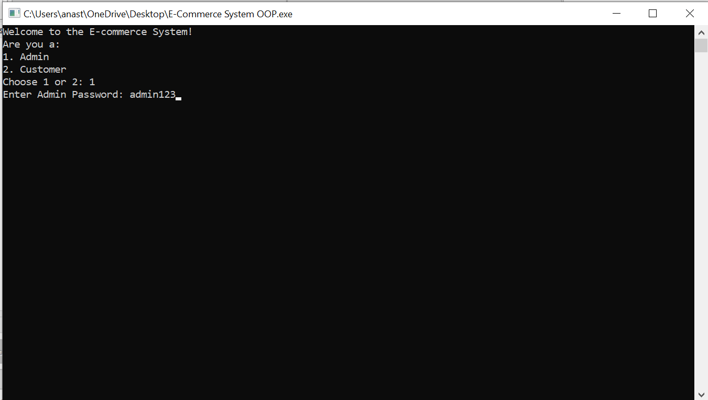
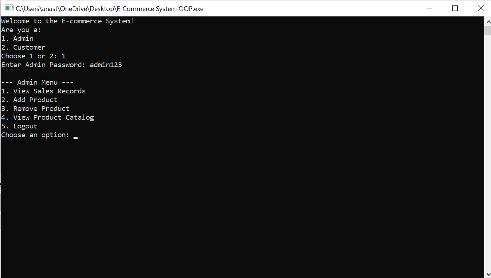
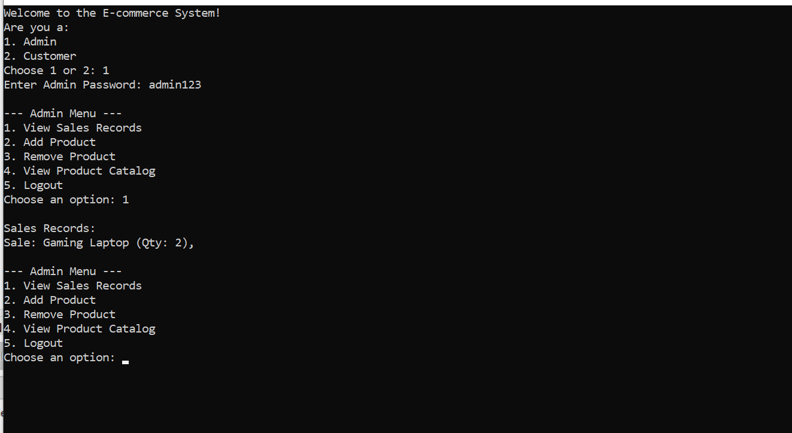

### Customer Registration & Login
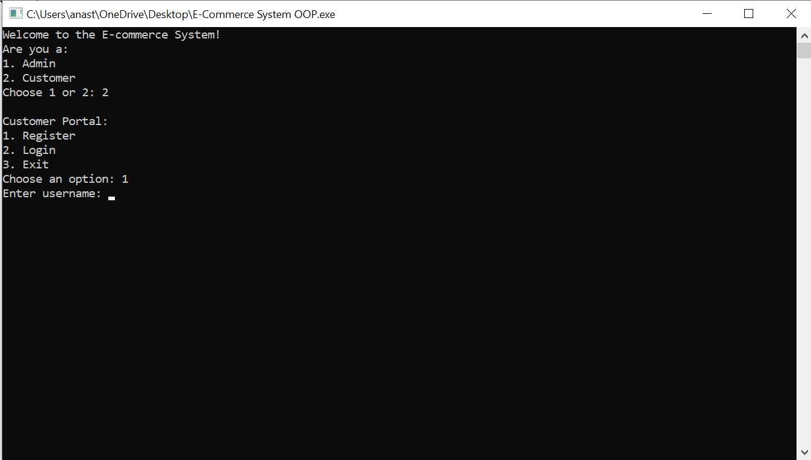
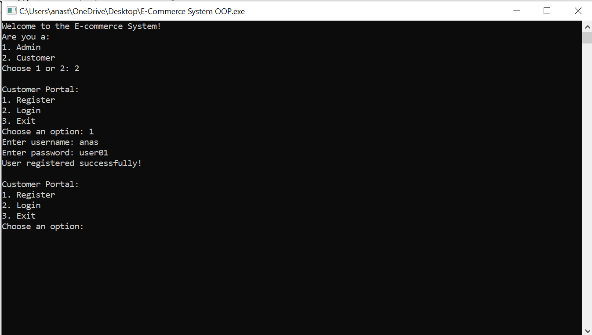
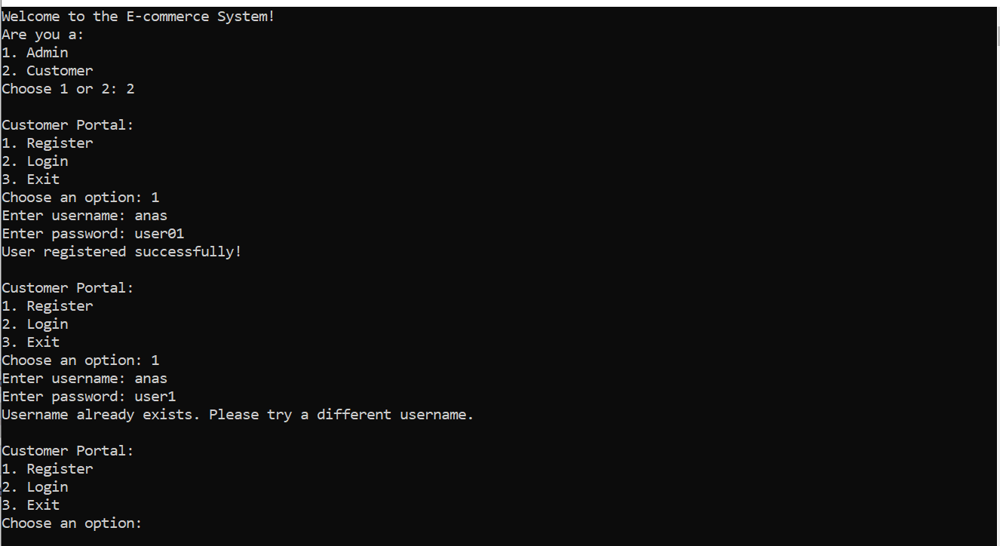

### Shopping Flow
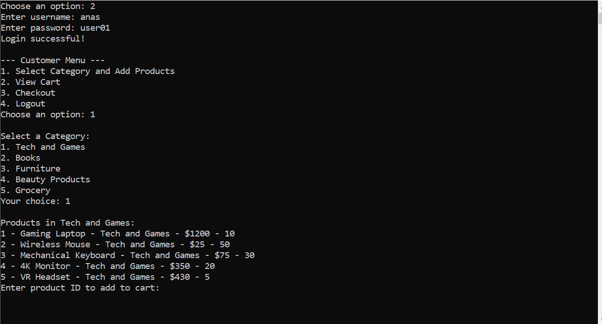

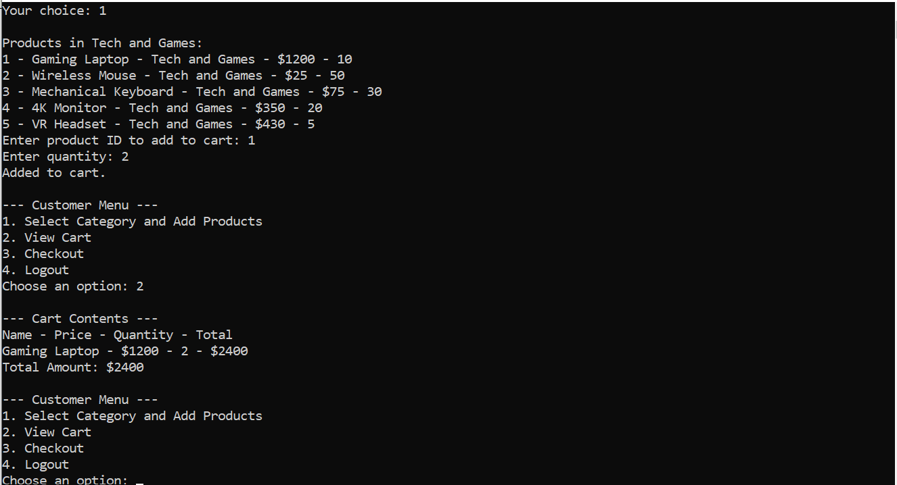
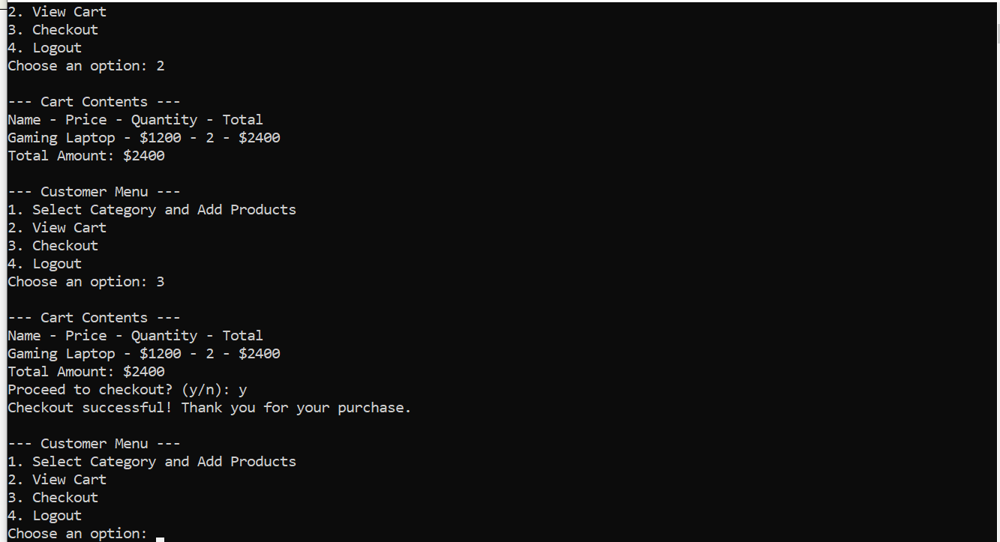
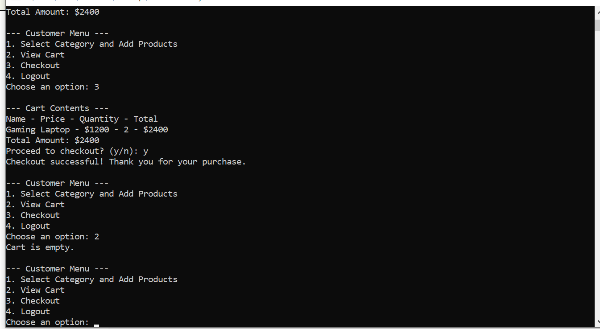

## Related Projects

- DSA E-Commerce System: https://github.com/anastahir00/Ecommerce-DSA

## Submission Date

June 10, 2025
